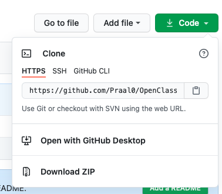
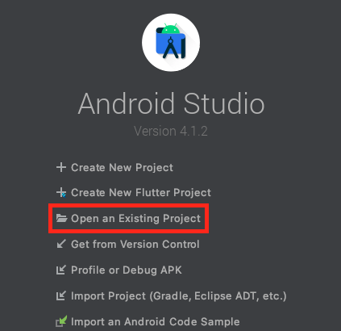
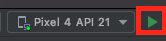
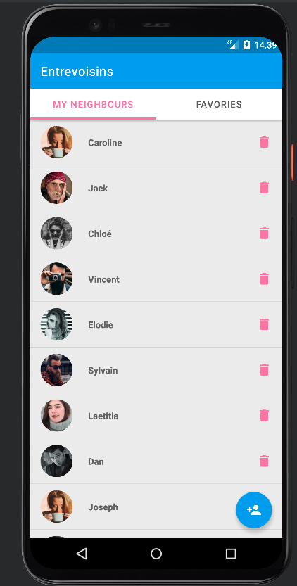

Introduction

Entrevoisins est une application qui permet à des personnes d’un même quartier de se rendre des petits services : garde d’animaux, petit bricolage, troc d’objets, cours particuliers, ou encore de passer un moment ensemble, de nombreuses options d'offrent aux utilisateur 

Configurer le projet dans Android Studio

======================================

1. Dans le terminal ce placer dans le dossier en utilisant cd/chemin du dossier ou crée le en utilisant la commande : mkdir

2. Téléchargez le code du projet, de préférence avec git clone avec l'url du projet git.

3. Ouvrir Android Studio et cliquer sur "Open an Existing Project", et sélectionner le repertoire correspondent

4. Compiler le projet en cliquant sur l'icône marteau.

5. Si besoin, séléctionner un appareil android et lancer le projet en cliquant sur l'icône flêche verte.

6. Profiter du projet et n'hésiter pas à contribuer au projet ou à faire part d'un bug sur le dépôt Github du projet.

